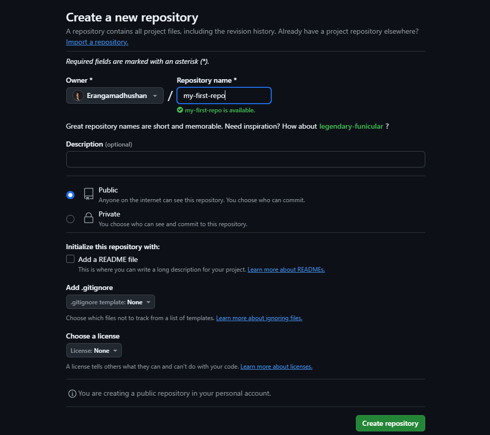

> [!IMPORTANT]
> Git VS GitHub

## Git is a version control system that tracks and manages code changes locally on your computer, while GitHub is a web-based platform that hosts Git repositories, enabling developers to store, share, and collaborate on code projects with others worldwide.

<a href="Git vs Github - Quick Guide.pdf" rel="noopener" download>Download PDF</a>

> [!TIP]
> # What is Git :-
- Git is a version control system
- Git helps you keep track of code changes
- Git is used to collabrate on code.
- Git and Github are different things


> [!TIP]
> # Why Git :-
- Over 70% of developers use Git !
- Developers can work together from anywhere in the world.
- Developers can see the full history of the project
- Developers can revert to earlier versions of the project if needed.
- Developers can see who made what changes and when.
- Developers can see the changes made in the code.

> [!TIP]
> # Features of Git :-
- When a file is changed added or deleted, it is considered modified
- Your select the modified files you want to Stage
- The Staged files are Committed, which prompts Git to store a permenent snapshot of the files
- Git allows you to see the full history of every commit
- You can revert back to any previous commit
- Git does not store a separate copy of every file in every commit, but keeps track of changes made in each commit !

> ======================================================================================

> [!TIP]
> # What is Github :-
- Git is not the same as GitHub.
- GitHub makes tools that use Git
- GitHub is the largest host of source code in the world, and has been owned by Microsoft since 2018.

> [!CAUTION]
> # Configuring git for the first time :-

```
$ git config --global user.name "<Enter Your first Name here >"
```

```
$ git config --globa user.email "<Enter Your Email here>"
```

> [!CAUTION]
> # General Git Features :-

> [!NOTE]
> ## Initializing Git :-
```
$ git init
```
- Git now knows that is should watch the folder you initated it on. Git creates a hidden folder to keep track of changes.

> [!NOTE]
> ## Staging files/Adding files to Git repo :-

Staged files are that are ready to be committed to the repository your are working on.<br/>
When your first add files to an empty repository, they are all untracked. To get Git to track them, you need to stage  them, or add them to the staging environment.

```
$ git add <filename with extension>
```

> [!TIP]
> ### Stagin all files in a folder :-
```
$ git add --all
```
### OR
```
$ git add -A
```


> [!NOTE]
> ## Making a Commit :-

Adding commits keep track of our progress and changes as we work. Git considers each commit changes point or "save point". It is a point in the project you can go back if you find a bug, or want to make a change.

When we commit, we should always include a message.

```
$ git commit -m "<Enter your commit message here >"
```

> [!TIP]
> ### Git Commit without Stage :-
Sometimes, when you make small changes, using the staging environment seems like a waste of time. It is possible to commit changes directly, skipping the staging environment.

```
$ git commit -a -m "<Enter Your message here>"
```

> [!NOTE]
> # Status of files and log :-

```
$ git status
```

> [!TIP]
> ### File status in a more compact way :-

```
$ git status --short
```

### OR
```
$ git status -s
```

> [!TIP]
> Log of a file :-

log is used to view the history of commits for a repo.
```
$ git log
```

```
$ git log --oneline
```

> [!CAUTION]
> # Git Help :-
If you are having trouble remembering commands or options for commands, you  can use Git help.

See all the available options for the specific command -

```
$ git <command> -help
```

See all possible commands - 

```
$ git help --all
```

If you find yourself stuck in the list view, SHIFT + G to jump the end of the list, then q to exit the view.

> [!CAUTION]
> # Git Branching :-
In Git, a branch is a new/separate version of the main repository. Branches allow you to work on different parts of a project without impacting the main branch. When the work is complete, a branch can be merged with the main project.

We can even switch between branches and work on different projects without them interfering with each other.

> [!NOTE]
> # Making a new Git Branch :-

```
$ git branch <name of branch>
```
> [!NOTE]
> # Checking all available Branches :-

```
$ git branch
```

> [!NOTE]
> # Switching to other Branches :-

```
$ git checkout <branch name>
```

> [!NOTE]
>#  Making a new branch an directly switching to it :-

```
$ git checkout -b <branch name>
```

> [!NOTE]
> # Deleting a Branch :-

```
$ git branch -d <branch name>
```

> [!NOTE]
> # Merging two Branches :-
It's preferred to change/switch to master branch before any branch needs to be merged with it.

```
$ git merge <branch name>
```

#### This will merge the specified branch with our master branch

> [!CAUTION]
> # Working with Github :-

Create a github account to create your remote repositories. Now, create a new repo where we will be uploading our files from local repo.



**Note**  - Local repository (repo) means the repo. which is on our system whereas, remote repo. means the one which is on other remote system/server, for eg:- GitHub, GitLab, Bitbucket, etc.

> [!NOTE]
> # Push local repo to GitHub :-
Copy the url or the link of the repo that we just created. As an example, it should look like this - [https://github.com/Erangamadhushan/my-first-repo.git](https://github.com/Erangamadhushan/my-first-repo.git)

Paste the copied url in the below git command.

```
$ git remote add origin <paste copied URL here>
```

'git remote add origin \<URL>' specifies that we are adding a remote repository, with the specified URL, as an origin to our local Git repo.

Finally, pushing our master branch to the origin URL(remote repo) add set it as the default remote branch.

```
$ git push --set-upstream origin master
```
<h3 align="center">Go back into GitHub and see that the repository has been updated.</h3>

> [!TIP]
> ### Pushing local repo to github after doing the above process at least once :-

First commit all the changes. Then push all the changes to our remote origin i.e remote repo on github.

```
$ git push origin
```

> [!NOTE]
> # Pull local repo from GitHub :-
Git pull is used to pull all changes from a remote repository into the branch we are working on. It is a combination of fetch and merge. Use it to update your local Git.

```
$ git pull origin
```

> [!NOTE]
> # Pull branch from GitHub :-

First check which branches we have and where are we working at the moment by 'git branch' command. Since we do not have the new branch on out local Git which is to be pulled from the Github. So, to see all local and remote branches, use -

```
$ git branch -a
```

> [!TIP]
> ### For viewing only remote branches :-
```
$ git branch -r
```

Now, the new branch is seen in the console but it is not available on our local repo. So, let's check it out using `git checkout <branch name>`. Now run `git pull` to pull that branch on our local repo. We can now check the available branches using `git branch`.

